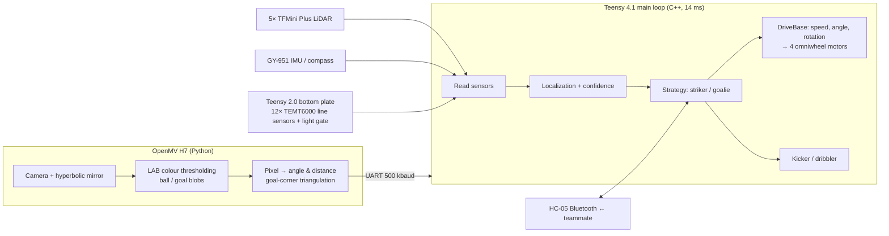

# SOCKS — Autonomous Soccer Robots (RoboCup Junior Soccer Open 2023)

Two fully autonomous robots that play 2v2 soccer: they find the ball with a 360° camera, localize themselves on the field, coordinate roles over Bluetooth, and kick to score. Built from scratch (hardware, PCBs, firmware, vision) by a team of three: Cadence Loh, Chloe Ong and Ashlee Chang.

**Results**
- 🥇 **1st place**, RoboCup Singapore Open 2023
- 🥉 **3rd place**, RoboCup 2023 International (Bordeaux, France)

📄 [Competition poster](rcjsocceropen_socks_poster.pdf) · 📓 [Engineering logbook (38 pages)](rcjsocceropen_socks_logbook.pdf)

---

## Highlights

- **Real-time control loop of 14 ms** on a Teensy 4.1, fusing camera, 5 LiDARs, IMU and 12 light sensors every cycle.
- **Omnidirectional vision** with a custom hyperbolic mirror (designed in Fusion360, vacuum-formed by hand) and an OpenMV H7 camera running colour-blob detection in Python.
- **Camera pipeline sped up from ~13 FPS to 70+ FPS** (in the lab) by fixing the sensor-initialisation order, cropping to the mirror region, precomputing angle lookup tables, and removing per-frame function overhead.
- **Sensor fusion with explicit confidence**: LiDAR localization reports a per-axis confidence score that drops when opponents block the sensors; camera-based localization from goal corners is used as a second estimate, and the robot scales its speed down when confidence is low.
- **Multi-agent coordination**: robots share ball position over Bluetooth and swap roles (striker ↔ goalie) when a teammate is taken out of play.
- **Non-blocking drivers**: rewrote manufacturer sensor libraries as state machines so no sensor read stalls the main loop.

---

## System overview

---

## Technical details

### 1. Vision: 360° object detection
An OpenMV H7 points upward into a hyperbolic mirror, giving the robot a full 360° view. The camera sits at one focus of the hyperbola, so every reflected ray passes through the other focus, which makes the pixel-to-angle mapping clean. We simulated the field of view in Fusion360 so the mirror would not see above the field walls (preventing false detections from the crowd).

Per frame (`bot1_cam.py`):
- Detect the ball and the goals using hand-tuned LAB colour thresholds (`find_blobs`).
- Convert blob positions to a bearing using a **precomputed atan2 lookup table** and to a pixel distance.
- Because hand-forming the mirror introduced error, we **calibrated pixel distance to real distance empirically** by measuring and fitting a pixel-vs-cm curve.
- Reject unreliable goal readings with a geometric sanity check on the corner angles.
- Send ball angle, ball distance and goal-corner angles to the Teensy over UART.

### 2. Localization with confidence
- **LiDAR-based:** five LiDARs measure distances to the walls. From these, the robot computes its (x, y) position and a **confidence value per axis** (`Robot::updatePos`), which falls when the measured span is shorter than the field (i.e. a robot is blocking the LiDAR).
- **Camera-based:** the angles to the left and right corners of a goal define two lines whose intersection gives a second position estimate. This is less affected by other robots and raises confidence when LiDARs are blocked.
- **Using confidence:** speed toward the boundary is scaled by confidence raised to a tunable power (`conf()` in `RobotFunctions.h`), so the robot slows down early enough for the line sensors to stop it before it goes out of bounds.

### 3. Ball control and scoring
- **Compass correction:** proportional controller on IMU heading keeps the robot facing the opponent's goal; gain tuned across speeds to avoid overshoot and oscillation.
- **Ball orbiting:** the robot orbits the ball along the shortest path into its capture zone, switching to the longer orbit near the boundary to avoid going out.
- **Aim and kick:** an IR light gate detects possession; the robot aims using localization, accelerates toward goal and fires a solenoid kicker (48 V boost circuit).

### 4. Robot-to-robot communication
- Robots exchange status and ball position over HC-05 Bluetooth.
- If the goalie loses sight of the ball (often occluded by its own striker), it uses the striker's ball position.
- If one robot is taken out of play, the other switches roles to maintain defence.

### 5. Hardware
- Teensy 4.1 main controller (upgraded from Teensy 3.5 because sensors were updating faster than the old loop could consume them), Teensy 2.0 on the bottom plate.
- Custom PCBs designed in Fusion360/EasyEDA; full robot CAD in Fusion360, within the 18 cm size limit.
- 4 omniwheels with JoinMax motors; drivers selected after testing PWM frequency and acceleration behaviour (see logbook).

---

## Repository layout

| Path | What it is |
|---|---|
| `maincode.ino` | Main robot program: initialisation and the 14 ms control loop |
| `SOCKS2023/` | Component libraries: `Robot`, `DriveBase`, `Motor`, `Camera`, `Lidar`, `GY` (IMU), `Kicker`, `Dribbler`, `BT`, plus strategy functions in `RobotFunctions.h` and tuning constants in `Tuning.h` / `Config2022.h` |
| `bot1_cam.py`, `bot2_cam.py` | OpenMV vision code for each robot (thresholds tuned per camera) |
| `bottomplate.ino` | Bottom-plate Teensy: line sensors and light gate |
| `2023_combined_gy/`, `2023_gy_calibrate/`, `getcalibvals_gy/`, `2023_*_gypcb/` | IMU/compass firmware and calibration tools |
| `rcjsocceropen_socks_poster.pdf` | Competition poster |
| `rcjsocceropen_socks_logbook.pdf` | Full engineering logbook (design decisions, debugging, tuning) |

## Tech stack
C++ (Arduino / Teensyduino) · Python (MicroPython on OpenMV) · Fusion360 · EasyEDA

## What I'd do differently
- Replace hand-tuned colour thresholds with a small learned detector, or at least auto-calibrate thresholds per venue, since thresholds had to be retuned whenever the lighting or camera changed (e.g. orange ball vs. yellow goal became hard to separate).
- Fuse LiDAR, camera and IMU estimates with a proper filter (e.g. a Kalman or particle filter) instead of confidence-weighted heuristics.
- Log sensor data during matches to tune parameters offline instead of on the field.
